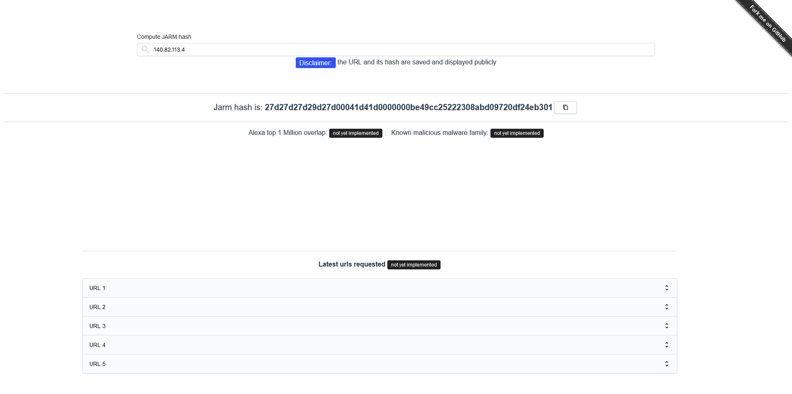

# jarm_online

This repository provides a way to compute [JARM hash](https://github.com/salesforce/jarm) via a web server.  
The API is written in Rust and leverage underneath [a rust library](https://github.com/Hugo-C/rustJarm).  
The GUI is made with Vue.js with the future goal to store previously computed hash, their maliciousness (based on a list
of known hash) and their overlap with top visited websites.

<div align="center">

# Live version: [jarm.chas.tel](https://jarm.chas.tel/)

[](https://jarm.chas.tel/)  
[](https://github.com/Hugo-C/jarm-online/actions/workflows/docker-publish.yml)  
[](https://deps.rs/repo/github/Hugo-C/jarm-online)

</div>

## Setup

API/GUI can be setup via [docker](docker-compose.yml).  
To run the service, simply use:

```shell
docker-compose up
```

A full set up from scratch can be used via ansible with [ansible_playbook.yml](terraform/ansible_playbook.yml) (tested on Debian 13)  
For development see [GUI's README](jarm_online_gui/README.md) to spinup the GUI locally and leverage auto-reload.

## API Endpoints

[OpenAPI of the list of endpoints currently available](https://jarm.chas.tel/api/v1/swagger-ui/) (see also [examples](examples)).

## Images statistics

|                                image                                 |                                                                                                                                                        RAM usage                                                                                                                                                        |                                                                             image size (compressed)                                                                              |
|:--------------------------------------------------------------------:|:-----------------------------------------------------------------------------------------------------------------------------------------------------------------------------------------------------------------------------------------------------------------------------------------------------------------------:|:--------------------------------------------------------------------------------------------------------------------------------------------------------------------------------:|
| [jarm_online_api](https://hub.docker.com/r/hugocker/jarm_online_api) | [](https://netdata.chas.tel/spaces/gcp-free/rooms/local/overview#selectedIntegrationCategory=deploy.operating-systems&chartName-val=menu_cgroup&local--chartName-val=menu_cgroup) | [](https://hub.docker.com/r/hugocker/jarm_online_api/tags) |
| [jarm_online_gui](https://hub.docker.com/r/hugocker/jarm_online_gui) | [](https://netdata.chas.tel/spaces/gcp-free/rooms/local/overview#selectedIntegrationCategory=deploy.operating-systems&chartName-val=menu_cgroup&local--chartName-val=menu_cgroup) | [](https://hub.docker.com/r/hugocker/jarm_online_gui/tags) |

## GUI looks

