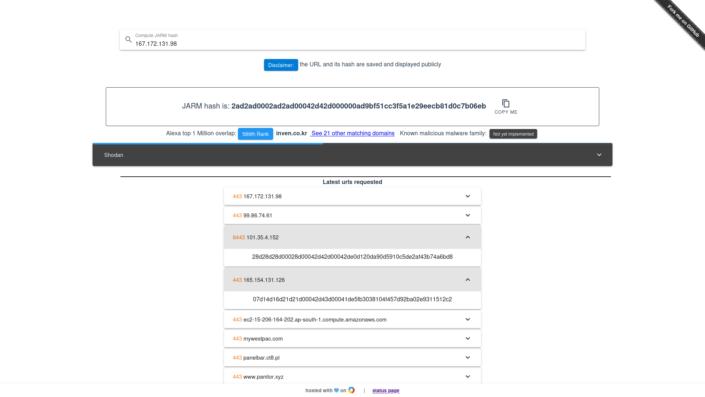

# jarm_online
This repository provides a way to compute [JARM hash](https://github.com/salesforce/jarm) via a web server.  
The API is written in Rust and leverage underneath [a rust library](https://github.com/Hugo-C/rustJarm).  
The GUI is made with Vue.js with the future goal to store previously computed hash, their maliciousness (based on a list of known hash) and their overlap with top visited websites.

## Setup
API/GUI can be setup via [docker](docker-compose.yml).  
To run the service for production, simply use:
```shell
docker-compose up
```
For development see [GUI's README](jarm_online_gui/README.md) to spinup the GUI locally and leverage auto-reload.

## API Endpoints
A single endpoint is currently available:
````http request
GET /jarm?host=<host>&port=<port>
````
It takes a required `host` parameter and optionally `port` (default to 443).  
See [example.http](examples.http) for examples.

## GUI looks
